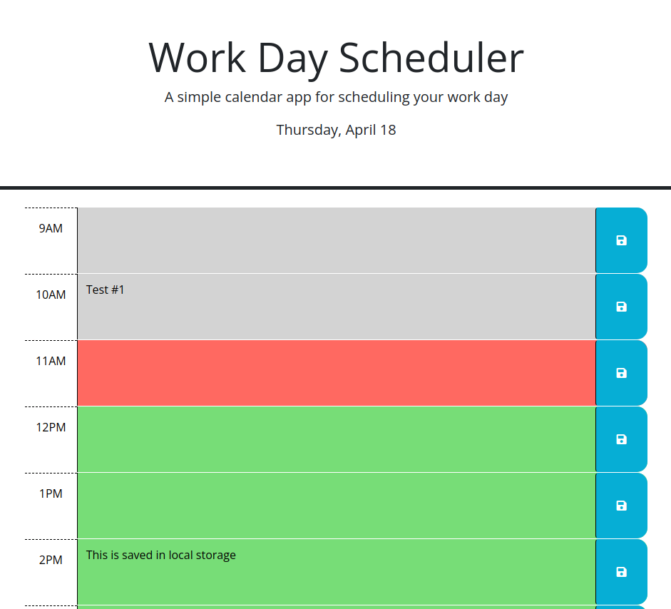

# Work Day Scheduler

## Description

I was motivated to work on this to help plan for a the workday. I wanted to build this so I can have a better understanding on how to use jQuery and how to change the DOM. It solves the problem of not having a visual aid during the work day and to have persistent data. I learned how to use for loops, incrementing through loops, jQuery, Dayjs, parsing through JSON objects, and how to use increments to alter IDs to use when changing the DOM.

## Usage
This runs within a web browser that supports the latest Bootstrap and allows JavaScripts.

